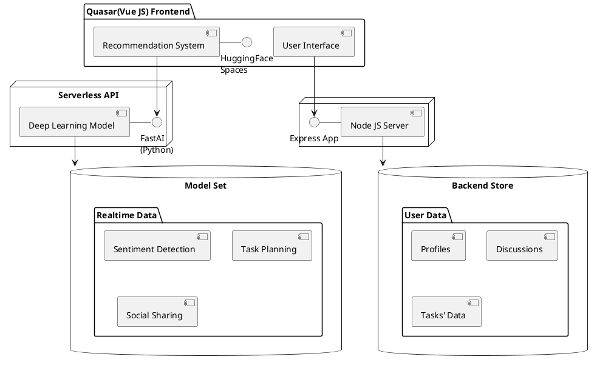

# 
Team: The Boys

### 
Present

Boost Your Productivity with Gamification and Deep Learning

---

# 
01 - Introduction

In today's fast-paced world, productivity has become more important than ever. Whether you're a student, a working professional, or a business owner, you need to be productive to achieve your goals and stay ahead of the competition. But productivity isn't always easy to achieve. It requires focus, discipline, and motivation, and it's easy to get sidetracked by distractions, procrastination, and lack of direction.

That's where the "Eat the Frog" method comes in. This productivity method, popularized by Brian Tracy in his book "Eat That Frog!", is based on the idea that you should tackle your most challenging task (or "frog") first thing in the morning, when you have the most energy and focus. By doing so, you'll build momentum and confidence, and the rest of your day will feel more manageable.

Introducing Froggy Focus - a web app built with JavaScript that takes the "Eat the Frog" method to the next level. With Froggy Focus, you'll be able to build a gamification system around this powerful productivity method and use Deep Learning in-app to achieve your productivity goals.

---

# 
02 - Problem Statement

🤔 <strong>Procrastination and lack of motivation</strong> are common problems that affect individuals of all ages and backgrounds. Many people struggle with staying focused and productive, especially when faced with complex or challenging tasks. This can lead to feelings of overwhelm, anxiety, and frustration, which can further exacerbate the problem.

While there are several productivity methods available, such as Pomodoro, Eisenhower Matrix, and Getting Things Done, these methods may not work for everyone. Traditional productivity methods often require a high degree of discipline, willpower, and motivation, which can be difficult to maintain in the long term. Moreover, these methods do not take into account the individual's unique productivity patterns, preferences, and strengths.

Froggy Focus offers a unique solution to the problem of procrastination and lack of motivation. With its gamification features, users can enjoy a fun and engaging way to stay motivated and focused on their tasks. And with its Deep Learning capabilities, it can provide personalized feedback and insights to help users achieve their productivity goals.

---

# 
03 - Proposed Features

✅ Users can earn points, badges, and rewards for completing tasks, meeting goals, and staying on track. With its intuitive interface and colorful graphics, it makes productivity feel like a game, making it easier for users to stay motivated and focused.

✅ By creating a to-do list and organizing tasks by priority, users can stay focused on what matters most and avoid getting distracted by less important tasks. The goal-setting feature also allows users to track their progress and celebrate their achievements, further motivating them to stay on track.

  

✅ By tracking user behavior, preferences, and patterns, it can offer insights into how users can improve their productivity and achieve their goals more efficiently. This feature makes it a truly personalized productivity tool that adapts to each user's unique needs and habits.

✅ By connecting with others and sharing their successes, users can stay accountable and motivated, further enhancing their productivity.

---

# 
04 - Proposed Tech Stack

---

# 
05 - Deep Learning Models

🔍<strong>Recommendation Systems</strong>   In Froggy Focus, recommendation systems could be used to suggest tasks, goals, and habits based on the user's productivity patterns, preferences, and strengths. By providing personalized recommendations, Froggy Focus can help users stay on track and achieve their goals more efficiently.

🥗<strong>Sentiment Analysis</strong>   In Froggy Focus, sentiment analysis could be used to analyze user feedback and comments to identify areas for improvement and address user concerns. By analyzing user sentiment, Froggy Focus can improve its user experience and better meet the needs of its users.

These Deep Learning models could enhance the functionality of Froggy Focus and provide users with personalized insights, feedback, and recommendations to improve productivity and goal attainment.

---

# 
06 - Impact Areas

        

💪Personal Productivity: The potential impact of Froggy Focus on personal productivity includes - Increased task completion and goal attainment, Reduced procrastination and distractions, Improved time management skills, Enhanced motivation and engagement

📖Educational Productivity: The potential impact of Froggy Focus on educational productivity includes - Improved academic performance and grades, Enhanced time management and study skills, Increased student engagement and participation
Reduced academic stress and anxiety

🌟Corporate Productivity: The potential impact of Froggy Focus on corporate productivity includes - Improved employee performance and efficiency, Enhanced collaboration and teamwork, Increased employee engagement and job satisfaction, Reduced employee turnover and absenteeism

These are just a few examples of the use cases and potential impact of Froggy Focus. By providing personalized recommendations, prioritization tools, and gamification features, Froggy Focus has the potential to positively impact productivity in various settings.

---

# 
07 - Business Prospects

🌿<strong>Subscription Plans</strong>   Froggy Focus can offer subscription plans that provide users with access to premium features and personalized recommendations. The subscription plans can be offered on a monthly or annual basis, with different tiers of features and pricing.

💰<strong>Advertisements/Sponsored Content</strong>   Another potential revenue stream for Froggy Focus is sponsored content. By partnering with relevant brands, Froggy Focus can feature sponsored content that provides users with valuable insights and resources.

Froggy Focus has a significant market potential as a productivity app. The market for productivity apps is expected to grow at a significant rate in the coming years, with an increasing number of individuals and businesses seeking ways to improve their productivity and efficiency.

---

# 
08 - Conclusion

In conclusion, Froggy Focus is a productivity app that leverages gamification and deep learning models to help individuals and businesses improve their productivity and efficiency. The app offers personalized goal-setting and feedback features, social sharing, and deep learning models such as recommendation systems, time-series analysis, sentiment analysis, and neural networks.
 
Traditional productivity methods may not work for everyone, and procrastination and lack of motivation can be significant obstacles to productivity. Froggy Focus provides a unique solution that engages users with a fun and interactive approach, while also utilizing deep learning models to provide personalized recommendations and insights.
 
Froggy Focus has significant market potential and offers various revenue streams such as subscription plans, advertisements, and sponsored content. The app can also benefit from partnerships and collaborations with other productivity apps and businesses.
 

---

# 
Thank You!

### 
We put a lot of time and effort tinkering with the idea and formulating this proposal, so we appreciate your patience and curiosity ✌

<strong><a href="http://www.linkedin.com/in/palash-johri-3301">Palash Johri</a></strong>

<strong><a href="https://www.linkedin.com/in/rishu-s-551b37197">Rishu Singh</a></strong>

